# Structure from Motion Implementation Project


- **Authors:**  
CHERIA Mehdi  
ELBARADEY Somaia   
SHILI Samer 

- **Instructors:**  
Lord Prof. Dr. David Fofi  
Yohan Fougerolle  
Zaar Khizar    

## abstract

This project implements a complete Structure from Motion (SfM) pipeline that reconstructs 3D scenes from sequences of 2D images taken from different positions. In this project , pre calibrated 2D images taken from different ponits of view are provided , The implementation builds a sparse 3D point cloud through feature detection, matching, camera pose estimation, triangulation, and bundle adjustment.The problem is solved using classical methods of computer
vision.


## Objective

The objective of this project is to implement a complete Structure from Motion pipeline that reconstructs a sparse 3D point cloud of a static scene from multiple calibrated or pre-calibrated images. This includes:
- Detecting and matching robust feature points across images  
- Estimating the fundamental and essential matrices to recover camera motion  
- Computing camera poses and performing triangulation  
- Registering additional views to refine the reconstruction and expand the 3D model


## **Theory**

### Structure from Motion Pipeline

Structure from Motion is a photogrammetric technique that estimates 3D structures from 2D image sequences. The process works by:

1. **Feature extraction & Matching and Outlier Rejection using RANSAC**: Identifying distinctive points in each image and finding correspondences between them.
2. **Relative Pose Estimation**: Computing the essential matrix from the fundamental matrix and recovering camera pose.
3. **Triangulation and reprojection error**: Reconstructing 3D points from matched 2D points and known camera poses.
4. **Incremental Reconstruction**: Adding more images to the reconstruction through PnP (Perspective-n-Point) and estimate the pose.
5. **Bundle Adjustment and 3D points refinement**: Refining both camera poses and 3D points to minimize reprojection error.


## 1. **Theoretical Foundations of Epipolar Geometry**

Understanding Structure from Motion begins with the fundamentals of camera geometry and the relationships between views. This section outlines the core geometric and algebraic models that underpin 3D reconstruction from images.

---

###  1.1 Camera Model (Pinhole Projection)

In SfM, we assume a **pinhole camera model**, where a 3D point \( X = [X, Y, Z]^T \) is projected onto a 2D image point \( x = [x, y]^T \) via the camera projection matrix:

\[
x = K [R \,|\, t] X
\]

Where:
- \( R \), \( t \): Rotation and translation (camera pose)
- \( K \): Intrinsic parameters matrix (focal lengths and principal point)
$$
K = \begin{bmatrix}
f_x & 0 & c_x \\
0 & f_y & c_y \\
0 & 0 & 1
\end{bmatrix}
$$
Where:
- $(f_x, f_y)$ are the focal lengths in pixel units
- $(c_x, c_y)$ is the principal point (optical center) in pixel coordinates

- \( P = K[R|t] \): Full camera projection matrix

---


###  1.2 Epipolar Geometry

Epipolar geometry describes the **intrinsic projective geometry** between two views. It defines how a 3D point \( X \) observed from two different camera centers \( C \) and \( C' \) projects to corresponding image points \( x \) and \( x' \).

- All three points \( X \), \( x \), and \( x' \) lie in a common plane called the **epipolar plane**.
- The projection of this plane on each image results in **epipolar lines**.
- A point \( x \) in image 1 will have its corresponding point \( x' \) somewhere along its **epipolar line** in image 2.

Let us consider the case where a 3D point \( X \) is visible in two images as \( x \) in the first image and \( x' \) in the second. Suppose only \( x \) is known.
Since the point \( X \), and the two camera centers \( C \) and \( C' \), all lie in the same **epipolar plane** \( \pi \), the corresponding point \( x' \) must lie along the intersection of this plane with the second image plane. This intersection is known as the **epipolar line** \( l' \) corresponding to \( x \) as shown in figure 2.
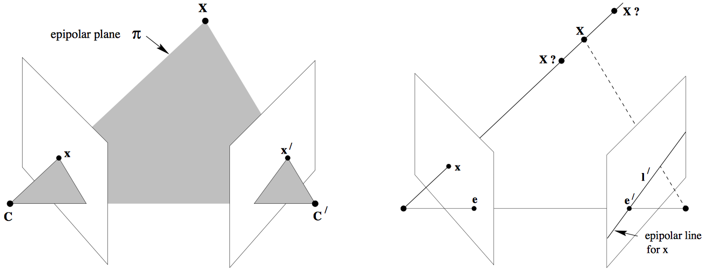
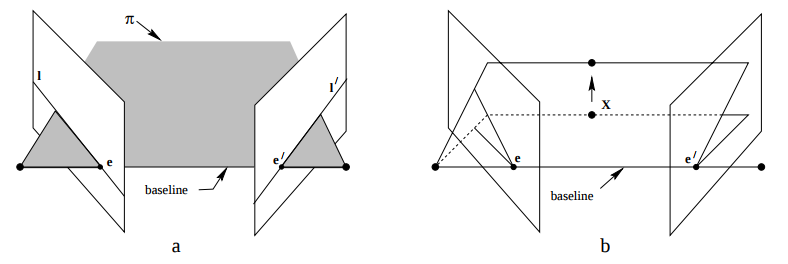
Key definitions:
- **Epipole**: Intersection of the baseline (line between camera centers) with the image plane.
- **Epipolar Line**: The projection of a 3D ray in the second view.
- **Epipolar Plane**: Plane containing the 3D point and both camera centers.

The benefit is computational: we **don’t search over the full image**, but only along the corresponding epipolar line.

---

## 2. Camera Calibration Theory

Camera calibration is the process of estimating the **intrinsic parameters** of a camera that define how 3D points in the world are projected onto the 2D image plane.The goal is to compute the **intrinsic matrix \( K \)**.


### 2.1 How Calibration Works

To estimate \( K \), we:
1. Use a known **calibration pattern**, typically a **checkerboard**.
2. Capture multiple images (8–10) of the checkerboard from different angles.
3. Detect corner points using OpenCV.
4. Solve for the camera intrinsics by minimizing reprojection error using:


### 2.2 Our Case

In our project, we used a **(10×7)** checkerboard grid, capturing around **10 images** for calibration. Once the intrinsics were computed, we reused the same camera matrix \( K \) throughout the reconstruction process.

> Note: If the dataset is already calibrated (like TempleRing), calibration is skipped, and \( K \) is provided like our first case computation.

---
## 3. **Feature extraction & Matching and Outlier Rejection using RANSAC**: 
Before diving into the theory of feature matching and outlier rerjection , lets begin with the mathematical basics to start with . 

## 3.1 Feature Extraction & Matching

Feature extraction involves identifying distinctive, repeatable keypoints in each image, often using algorithms like SIFT (Scale-Invariant Feature Transform). Each keypoint is described by a local descriptor—a high-dimensional vector that encodes gradient orientation information.

**Mathematics**:
- Keypoints are detected as extrema in scale space using the Difference of Gaussians (DoG):
  \[
  D(x, y, \sigma) = [G(x, y, k\sigma) - G(x, y, \sigma)] * I(x, y)
  \]
  where \( G \) is the Gaussian filter, \( \sigma \) is the scale, and \( I(x, y) \) is the image.

- Each keypoint is described by a 128-dimensional SIFT descriptor vector constructed from gradient orientations in a 16×16 region around the keypoint.

**Matching**:  
Descriptors between image pairs are matched using nearest-neighbor search in descriptor space, typically with a **k-Nearest Neighbors (k=2)** approach.

**Lowe’s Ratio Test**:
\[
\frac{\|d_{\text{query}} - d_1\|}{\|d_{\text{query}} - d_2\|} < 0.7
\]
⮕ This test filters ambiguous matches by comparing the closest and second-closest descriptor distances.


---
## 3.2 Match Analysis Utilities

### Purpose
These functions analyze feature matches between image pairs to:
1. Quantify total matches (`count_total_matches`)
2. Evaluate image pair connectivity (`display_connected_pairs`)
3. Build an adjacency matrix for graph representation (`build_adjacency_matrix`)

### Key Concepts

1. **Match Counting**:
   - Sums matches in the upper triangle of the match matrix (avoiding duplicates from symmetric pairs).
   -  $\sum_{i=1}^n \sum_{j=i+1}^n |matches[i][j]|$

2. **Connectivity Check**:
   - Identifies image pairs with at least one valid match.
   - Useful for detecting isolated images in the reconstruction graph.

3. **Adjacency Matrix**:
   - Constructs a binary matrix $A$ where:
     \[
     A_{ij} = \begin{cases} 
     1 & \text{if images } i \text{ and } j \text{ have matches} \\
     0 & \text{otherwise}
     \end{cases}
     \]
   - Also returns a list of connected pairs for traversal.

---
## 3.3 Fundamental Matrix \( F \)

The **fundamental matrix** encodes the epipolar constraint algebraically. It maps a point in image 1 to its corresponding **epipolar line** in image 2.To estimate it , at least **8 point correspondences** between two images are required. These correspondences form a linear system:

\[
A \cdot f = 0
\]
Where:
- \( A \) is a matrix built from the matched points,
- \( f \) is a 9×1 vector representing the unknown elements of \( F \).
\[
[x'_i\ y'_i\ 1]
\begin{bmatrix}
f_{11} & f_{12} & f_{13} \\
f_{21} & f_{22} & f_{23} \\
f_{31} & f_{32} & f_{33}
\end{bmatrix}
\begin{bmatrix}
x_i \\
y_i \\
1
\end{bmatrix}
= 0
\]

This system is solved using **Singular Value Decomposition (SVD)**:

\[
A = U \Sigma V^T
\]
\[
\begin{bmatrix}
x_1 x'_1 & x_1 y'_1 & x_1 & y_1 x'_1 & y_1 y'_1 & y_1 & x'_1 & y'_1 & 1 \\
x_2 x'_2 & x_2 y'_2 & x_2 & y_2 x'_2 & y_2 y'_2 & y_2 & x'_2 & y'_2 & 1 \\
\vdots & \vdots & \vdots & \vdots & \vdots & \vdots & \vdots & \vdots & \vdots \\
x_m x'_m & x_m y'_m & x_m & y_m x'_m & y_m y'_m & y_m & x'_m & y'_m & 1 \\
\end{bmatrix}
\begin{bmatrix}
f_{11} \\
f_{21} \\
f_{31} \\
f_{12} \\
f_{22} \\
f_{32} \\
f_{13} \\
f_{23} \\
f_{33} \\
\end{bmatrix}
= 0
\]

The solution is the **last column of \( V \)**, corresponding to the smallest singular value.

However, due to noise, the estimated \( F \) may have full rank (3). To enforce the correct **rank-2 constraint**, we set the smallest singular value of \( F \) to zero and recompute \( F \).

🔹 A true fundamental matrix must be rank 2; otherwise, it fails to define valid epipolar geometry (no epipoles).

---

## 3.4 Essential Matrix \( E \)

When the cameras are **calibrated**, we can compute the **essential matrix**:

\[
E = K^T F K
\]

Where:
- \( K \) is the intrinsic matrix of the camera
- \( E \) encodes the relative **rotation and translation** between cameras

The essential matrix satisfies the same epipolar constraint:

\[
x'^T E x = 0
\]

Decomposing \( E \) (using SVD) gives the relative **rotation \( R \)** and **translation \( t \)**, which are used for pose recovery and triangulation.


---

## 3.5 Outlier Rejection using RANSAC

Since the point correspondences are computed using SIFT , the data is bound to be noisy and in general contains several outliers. Thus, to remove these outliers, we use RANSAC algorithm to obtain a better estimate of the fundamental matrix. So, out of all possibilities, the F matrix with maximum number of inliers is chosen. Below is the pseduo-code that returns the F
matrix for a set of matching corresponding points (computed using SIFT) which maximizes the number of inliers.

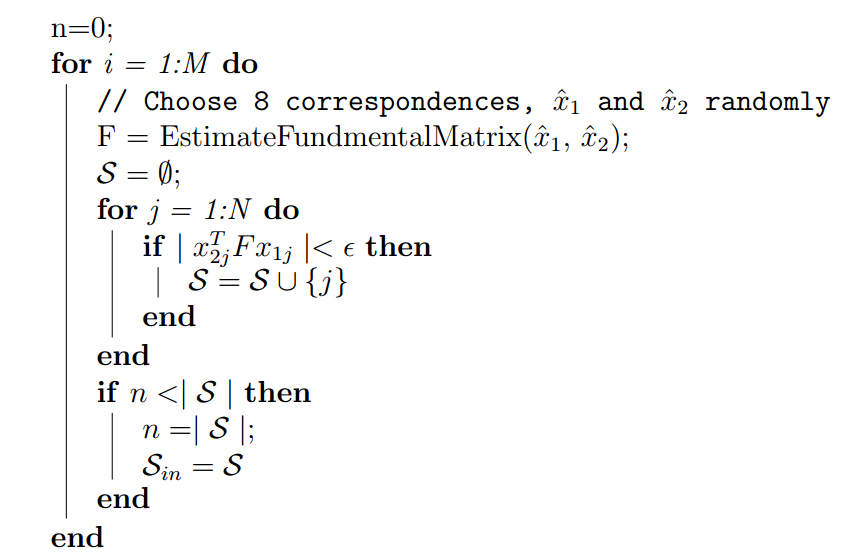

**Mathematics**:
The fundamental matrix relates corresponding points between two views:
\[
x_j^T F x_i = 0
\]
where \( x_i \) and \( x_j \) are homogeneous coordinates of matched keypoints in image 1 and image 2, respectively.

**RANSAC Algorithm**:
1. Randomly sample minimal sets (≥8 pairs for F).
2. Estimate a candidate fundamental matrix \( F \).
3. Compute reprojection error for all matches.
4. Count inliers: points that satisfy
   \[
   \text{error} = |x_j^T F x_i| < \epsilon
   \]
5. Repeat for N iterations; keep the model with the highest inlier count.

⮕ This improves the geometric consistency of matches and reduces the influence of noise or mismatches.

---
## 4. **Relative CamPose Estimation**:
### 4.1 Camera Pose from Essential Matrix

The relative camera pose between two views consists of:
- **Rotation** (3 DOF): $R \in SO(3)$  
- **Translation** (3 DOF): $t \in \mathbb{R}^3$

Given the Essential Matrix $E = U D V^T$, four possible pose configurations exist:

| Solution | Rotation ($R$)          | Camera Center ($C$) |
|----------|--------------------------|---------------------|
| 1        | $U W V^T$                | $U[:,2]$            |
| 2        | $U W V^T$                | $-U[:,2]$           |
| 3        | $U W^T V^T$              | $U[:,2]$            |
| 4        | $U W^T V^T$              | $-U[:,2]$           |

Where $W = \begin{bmatrix}0&-1&0\\1&0&0\\0&0&1\end{bmatrix}$ ensures $det(R)=1$.

### 4.2 Resolving Ambiguity with Cheirality Condition

Only one solution places all 3D points **in front of both cameras**. The cheirality condition enforces:

$$
r_3(X - C) > 0
$$

- $r_3$: Third row of $R$ (camera's z-axis)  
- $X$: 3D point in world coordinates  
- $C$: Camera center  

**Verification Process**:
1. Triangulate matched points for each candidate pose.
2. Count points satisfying:
   - $Z_{cam} > 0$ in **both** cameras (positive depth)
3. Select the pose with **maximum valid points**.

---
## 5. **Triangulation and reprejection error**
### 5.1 Linear Triangulation (Initial Estimate)
Given two camera poses with projection matrices \( P_1 \) and \( P_2 \), a 3D point \( X \) can be estimated by solving the linear system:
\[
\begin{cases}
x_1 \times (P_1 X) = 0 \\
x_2 \times (P_2 X) = 0 
\end{cases}
\]
where \( x_1, x_2 \) are 2D correspondences in homogeneous coordinates. This minimizes the **algebraic error** via SVD.

### 5.2 Nonlinear Refinement (Reprojection Error)
The linear solution is refined by minimizing the **geometric reprojection error**:
\[
\min_X \sum_{j=1}^2 \left( \left(u_j - \frac{P_j^{(1)} \tilde{X}}{P_j^{(3)} \tilde{X}}\right)^2 + \left(v_j - \frac{P_j^{(2)} \tilde{X}}{P_j^{(3)} \tilde{X}}\right)^2 \right)
\]
where:
- \( P_j^{(i)} \): \( i \)-th row of camera \( j \)'s projection matrix
- \( \tilde{X} \): Homogeneous coordinates of \( X \) (\( \tilde{X} = [X^T, 1]^T \))
- \( (u_j, v_j) \): Observed 2D point in image \( j \)

---
## 6. **Incremental Reconstruction**


In the incremental Structure from Motion pipeline, once we have an initial set of 3D points reconstructed from previous views, we can estimate the **pose of a new camera** using the **Perspective-n-Point (PnP)** method.

### 6.1 What is PnP?

PnP is the problem of finding the position and orientation of a camera given:

- A set of **3D points** \( \{X_i\} \) in world coordinates
- Their corresponding **2D projections** \( \{x_i\} \) in the new image
- The **intrinsic camera matrix** \( K \)

The goal is to find the rotation \( R \) and translation \( t \) that satisfy:

\[
x_i \approx K [R \mid t] X_i
\]

This means projecting the known 3D points into the image and minimizing the error between the projected and observed 2D points.

### 6.2 Our Implementation

- We extract 3D–2D correspondences between an already-reconstructed camera and the new image.
- We use OpenCV's `solvePnP` with the **iterative Levenberg–Marquardt** algorithm to estimate \( R \) and \( t \).
- We repeat the estimation several times on random 6-point subsets and choose the best pose based on reprojection error as a mini RANSAC algorithm mentionned below.
- The quality of each pose is evaluated by computing how well the 3D points project onto the image plane (reprojection error and inlier ratio).
 

####  6.3 Role of PnP in SfM

PnP is used **each time a new image is added** to the reconstruction. It provides the pose of the new camera relative to the existing 3D structure, allowing us to triangulate new points and expand the 3D model incrementally.

---

## 7. **Bundle Adjustment**

Bundle adjustment is a large sparse geometric optimization problem that minimizes reprojection error:

$$
\min_{R_i, t_i, X_j} \sum_{i,j} d(P_i X_j, x_{ij})^2
$$

Where:
- $P_i = K[R_i|t_i]$ is the projection matrix for camera $i$
- $X_j$ is the 3D point $j$
- $x_{ij}$ is the observed 2D point in image $i$ corresponding to 3D point $j$
- $d(\cdot,\cdot)$ is the reprojection error (typically Euclidean distance)

---

## **Methodology**

## 1.Extractiong and Matching Features 

This section describes the implementation steps of our Structure from Motion pipeline. We focus here on the initial stages: from loading the dataset to building the image-pair connectivity graph.

---

###  1.1 Camera Calibration (Skipped)

Although camera calibration is essential for custom datasets, our project uses **pre-calibrated datasets** like *TempleRing* and *DinoRing*, which already provide intrinsic parameters.  
➡️ **No calibration code was required at this stage.**

---

###  1.2 Image Loading

Images are loaded in grayscale from a dataset folder, and the corresponding **intrinsic matrix \( K \)** is returned based on the dataset name.

```python
img = cv2.imread(str(path), cv2.IMREAD_GRAYSCALE)
```

Each image is stored in a list, and camera intrinsics are selected from a predefined dictionary:

```python
CAMERA_MATRICES: Dict[str, np.ndarray] = {
    'templering': np.array([[...]]),
    'dingoring': np.array([[...]])
}
```

---

## 2. Feature Extraction (SIFT)

SIFT (Scale-Invariant Feature Transform) is applied to each image to extract keypoints and descriptors:

```python
sift = cv2.SIFT_create()
kp, des = sift.detectAndCompute(img, None)
```

The function returns:
- `keypoints`: coordinates and scales of features
- `descriptors`: 128-dimensional vectors representing local appearance

---

## 3. Feature Matching (Lowe's Ratio Test)

For each pair of images, we perform descriptor matching using **Brute-Force Matching** with k-nearest neighbors (k=2), followed by **Lowe’s Ratio Test** to filter out ambiguous matches:

```python
raw = matcher.knnMatch(descriptors[i], descriptors[j], k=2)
good = [m[0] for m in raw if len(m) == 2 and m[0].distance < 0.7 * m[1].distance]
```

Result:
- A **match matrix** is built: `matches[i][j]` contains filtered matches between image `i` and `j`.

---

## 4. Outlier Removal using RANSAC

To ensure geometric consistency, each image pair’s matches are validated by estimating the **fundamental matrix** using RANSAC:

```python
F, mask = cv2.findFundamentalMat(pts_i, pts_j, cv2.FM_RANSAC, ransacReprojThreshold=3.0)
```

Inliers are kept:

```python
filtered = [d for k, d in enumerate(m) if mask[k]]
```

If the number of inliers is below a threshold (e.g., 20), the match is discarded.

---

##  5. Building the Adjacency Matrix

A binary **adjacency matrix** is created to record which image pairs have enough valid matches:

```python
adj[i, j] = 1 if matches[i][j] else 0
```

Each entry indicates whether images `i` and `j` are connected. This matrix helps construct the image connection graph and select the initial pair for reconstruction.

```python
adj = np.zeros((num_images, num_images), dtype=int)
pairs = []
for i in range(num_images):
    for j in range(i+1, num_images):
        if matches[i][j]:
            adj[i, j] = 1
            pairs.append((i, j))
```

---

## 6. Initial Pair Selection

To initialize the 3D reconstruction, we must choose a strong starting pair of images. This step is crucial for building a reliable baseline for triangulation.

We select the best pair based on two criteria:
- A **high number of matched features**
- A **large relative rotation angle** between the cameras

This ensures that the initial pair is both geometrically stable and informative.


- **`cv2.findEssentialMat`**: Computes the essential matrix \( E \) from matched 2D points and the known camera intrinsics.
- **`cv2.recoverPose`**: Extracts the relative rotation \( R \) and translation \( t \) between the two camera views.
- **`cv2.Rodrigues`**: Converts the rotation matrix into a vector for easy angle comparison.

---

##  7. Relative Pose Estimation

Once we select the best initial image pair with a sufficient number of inlier matches, we estimate the **relative camera pose** between those two views.

This step is crucial as it provides the first baseline in 3D space, from which all further views will be triangulated or added incrementally.

---

### Steps and Commands Used

#### 7.1 **Extract Matched Keypoints**
We retrieve the 2D matched points between the selected image pair using a utility function:

```python
pts_i, pts_j, _, _ = extract_matched_keypoints(i, j, keypoints, matches)
```

This gives us the coordinates of corresponding keypoints in both images.

---

#### 7.2 **Estimate the Essential Matrix**

Using the 2D point correspondences and the known camera intrinsics, we compute the **essential matrix**:

```python
E, _ = cv2.findEssentialMat(pts_i, pts_j, K, cv2.FM_RANSAC, 0.999, 1.0)
```

- **`cv2.findEssentialMat`** estimates the geometric relationship between the two views.
- It uses **RANSAC** to remove outliers.
- \( E \) satisfies the equation:  
  \[
  x'_i^T \cdot E \cdot x_i = 0
  \]

---

#### 7.3 **Recover Camera Pose (R, t)**

Once \( E \) is computed, we extract the **relative rotation** and **translation** between the two camera views:

```python
_, R, t, mask = cv2.recoverPose(E, pts_i, pts_j, K)
```

- **`cv2.recoverPose`** returns:
  - \( R \): rotation matrix
  - \( t \): translation vector
  - `mask`: indicates inlier matches used

This defines the **extrinsic parameters** of the second camera relative to the first one.

---

#### 7.4 **Evaluate the Rotation Angle**

To choose the best starting pair, we evaluate how strong the camera motion is. We do this by converting the rotation matrix into a **rotation vector** and measuring its magnitude:

```python
rotation_vector, _ = cv2.Rodrigues(R)
rotation_angle = np.sum(np.abs(rotation_vector))
```

The pair with the **largest rotation angle** (and full inlier support) is selected to begin reconstruction.

---

### Summary

- Extract 2D keypoint correspondences
- Estimate the essential matrix \( E \)
- Recover relative camera pose \( (R, t) \)
- Use rotation angle to pick the best image pair to initialize 3D reconstruction

This process sets up the **initial camera pose** and prepares the pipeline for triangulation and 3D point recovery.

---


## 8. Triangulation and Reprojection Error

After estimating the relative pose between the initial image pair, we proceed to **triangulate 3D points** from their corresponding 2D observations. This forms the first 3D structure in the reconstruction pipeline.

To assess the quality of these reconstructed 3D points, we project them back to the original images and compute the **reprojection error**.

---

### Steps and Commands Used

#### 8.1 **Construct Camera Projection Matrices**

We form the projection matrix \( P = K [R | t] \) for each camera:

```python
P_left = np.dot(K, np.hstack((R_left, t_left)))
P_right = np.dot(K, np.hstack((R_right, t_right)))
```

These matrices define how 3D points are projected onto each image plane.

---

#### 8.2 **Triangulate Points in 3D**

We use OpenCV's triangulation function to compute 3D points from corresponding 2D keypoints:

```python
hom_points = cv2.triangulatePoints(P_left, P_right, keypoints_left, keypoints_right)
points_3D = cv2.convertPointsFromHomogeneous(hom_points.transpose())
```

- The result is a list of 3D coordinates in the scene.
- Each point is associated with its 2D source observations using the custom `Point3DWithViews` class.

---

#### 8.3 **Optional: Reproject 3D Points**

We reproject the 3D points back into the two image planes and compare them to the original keypoints:

```python
proj_left, _ = cv2.projectPoints(points_3D, rvec_left, t_left, K, distCoeffs=np.array([]))
proj_right, _ = cv2.projectPoints(points_3D, rvec_right, t_right, K, distCoeffs=np.array([]))
```

- `cv2.projectPoints` projects 3D points using the known camera pose.
- `cv2.Rodrigues` is used to convert rotation matrices into vectors for projection.

It is conditionally executed based on the argument **reproject=True** which is used for for evaluation, debugging, or filtering out bad triangulated points, reprojection is very useful.
---

#### 8.4 **Compute Reprojection Error**

The reprojection error measures the distance (in pixels) between projected 3D points and the original 2D keypoints:

```python
errors_left = [np.linalg.norm(proj_left[i, 0] - keypoints_left[i]) for i in range(points_3D.shape[0])]
errors_right = [np.linalg.norm(proj_right[i, 0] - keypoints_right[i]) for i in range(points_3D.shape[0])]
```

We calculate the average error per image:

```python
avg_error_left = float(np.mean(errors_left))
avg_error_right = float(np.mean(errors_right))
```

These values are used to validate the accuracy of the triangulated points.

---

### Summary

- Triangulate initial 3D points from two views using `cv2.triangulatePoints`.
- Project them back using `cv2.projectPoints`.
- Measure reprojection error to assess the quality of reconstruction.

This step forms the **initial 3D point cloud**, which will be expanded incrementally in the next stages of the pipeline.

---

## 9. Incremental Reconstruction (PnP)

Once the initial image pair is triangulated, the pipeline enters the **incremental phase**, where new camera views are added one by one. This is done by estimating the pose of each new camera using **Perspective-n-Point (PnP)** and seeding new 3D points.

---

### Steps and Commands Used

#### 9.1 **Find 3D–2D Correspondences**

We loop through existing 3D points and check whether each point has a match in the new image:

```python
unresected_kpt_idx, is_valid = check_and_get_unresected_point(
    resected_kpt_idx, match, resected_idx, unresected_idx
)
```

- This checks if a known 3D point seen in one image also appears in the new image.
- If yes, we add this correspondence to a list of 3D–2D pairs for PnP.

---

#### 9.2 **Prepare Inputs for PnP**

All matching 3D points and their 2D projections in the new image are collected:

```python
pnp_points_3d.append(point_3d.coords)
pnp_points_2d.append(keypoints_list[unresected_idx][matched_kpt_idx].pt)
```

- These are used to estimate the new camera pose relative to the 3D model.

---

#### 9.3 **Estimate Camera Pose using PnP + RANSAC**

We apply `cv2.solvePnP` iteratively on random subsets of the correspondences to maximize inlier ratio:

```python
_, rvec, tvec = cv2.solvePnP(
    obj_pts, img_pts, K, distCoeffs=np.array([]), flags=cv2.SOLVEPNP_ITERATIVE
)
R, _ = cv2.Rodrigues(rvec)
```

- We test multiple random samples to choose the most stable pose.
- The result gives us the **rotation matrix \( R \)** and **translation vector \( t \)** of the new camera.

---

#### 9.4 **Evaluate PnP Pose via Reprojection**

We project each 3D point onto the image using the estimated pose and compute the reprojection error:

```python
X_cam = R_new.dot(pt3.reshape(3, 1)) + t_new
x_proj = K.dot(X_cam)
x_proj /= x_proj[2]
```

Then we compare it to the actual 2D keypoint and count it as an inlier if within a threshold:

```python
dx = float(x_proj[0] - pt2[0])
dy = float(x_proj[1] - pt2[1])
```

We calculate:
- Average reprojection error
- Inlier ratio (percentage of points within threshold)

The pose with the best inlier ratio is selected.

---

###  Summary

- Extract 3D–2D correspondences between known 3D points and the new image.
- Estimate the new camera pose using `cv2.solvePnP`.
- Validate the pose by checking reprojection accuracy.
- Once validated, this new view is added to the reconstruction and new points can be triangulated.

This process is **repeated** for each unregistered image until all images are incorporated into the 3D scene.

---


##  10. Bundle Adjustment and 3D Refinement

**Bundle Adjustment (BA)** is the final and most important optimization step in Structure from Motion. It jointly refines all:
- Camera poses (rotation + translation)
- 3D point coordinates

The goal is to minimize the **reprojection error** across all observed 2D–3D correspondences.

---

### Steps and Commands Used

#### 10.1 **Project 3D Points to 2D (projection.py)**

Each 3D point is projected back into its corresponding camera image using the current camera parameters:

```python
p2d, _ = cv2.projectPoints(X, rvec, t, K, distCoeffs=None)
```

This is done for all observations to compute expected 2D projections.

---

#### 10.2 **Compute Reprojection Residuals (residuals.py)**

The difference between observed 2D points and projected 2D points gives the reprojection error:

```python
residuals = (projected_2d - observed_2d).ravel()
```

Function: `ba_residuals(...)`  
Used to define the **objective function** for optimization.

---

#### 10.3 **Construct Jacobian Sparsity Matrix (sparsity.py)**

To make the optimization faster and scalable, we provide the sparsity pattern of the Jacobian:

```python
A = lil_matrix((2 * n_obs, n_params))
```

Each 2D observation only depends on:
- Its camera's 12 parameters (R flattened + t)
- The 3D point’s 3 coordinates

This tells the solver which derivatives are non-zero.

---

#### 10.4 **Run Sparse Least Squares Optimization (solver.py)**

The actual BA solver is run using `scipy.optimize.least_squares` with the trust-region reflective method:

```python
res = least_squares(
    ba_residuals, x0,
    jac_sparsity=A,
    ftol=ftol, xtol=1e-12,
    x_scale='jac', verbose=2, method='trf',
    args=(n_cams, n_pts, cam_idxs, pt_idxs, obs2d, K)
)
```

- `x0` is the initial guess (flattened camera + 3D point params)
- `ba_residuals` computes the reprojection error
- `A` is the Jacobian sparsity pattern

---

#### 10.5 **Update Refined Parameters**

After optimization:
- Updated camera rotations and translations are extracted:
```python
new_R[img] = flat[:9].reshape(3, 3)
new_t[img] = flat[9:].reshape(3, 1)
```
- Updated 3D point coordinates are set back into `Point3DWithViews`.

---

###  Summary

- All 2D–3D observations across multiple views are jointly optimized.
- Minimizes total reprojection error.
- Greatly improves 3D accuracy and visual consistency of the reconstructed model.

This is the final step that **refines our model globally** and corrects errors that accumulate during incremental reconstruction.

---

####  Algorithm Process

1. For every connected image pair in the **adjacency matrix**, check the number of matches.
2. Filter pairs that are within the **top X% of match count**.
3. For those, compute the essential matrix and recover the camera pose.
4. Choose the pair with the **largest rotation angle** and **valid full inlier set** as the initial pair.

```python
if rotation_angle > best_rotation_angle and num_points == len(pts_i):
    best_pair = (i, j)
```

⮕ The selected pair forms the **baseline** for the initial 3D triangulation and allows the SfM pipeline to expand incrementally from a reliable foundation.

---

## How to Run the Code

### Prerequisites

- Python 3.6 or higher
- Required packages: 
  - OpenCV (cv2)
  - NumPy
  - SciPy
  - Open3D (for visualization)
  - Matplotlib (for plotting)

Install dependencies:

```bash
pip install numpy opencv-python scipy open3d matplotlib
```
# Structure from Motion Implementation

## Directory Structure
Ensure your project has the following structure:

```
project/
├── datasets/
│   ├── templeRing/
│   │   ├── 00.png
│   │   ├── 01.png
│   │   └── ...
│   └── dinoRing/
│       ├── 00.png
│       ├── 01.png
│       └── ...
├── feature_matching/
│   ├── __init__.py
│   ├── feature_extraction.py
│   ├── feature_matching.py
│   ├── image_load.py
│   ├── outlier_remover.py
│   └── utilies.py
├── reconstructioning/
│   ├── __init__.py
│   ├── data_structure.py
│   ├── geometry.py
│   ├── initialization.py
│   ├── pnp.py
│   ├── reconstruct.py
│   ├── reprojection_error.py
│   ├── selection.py
│   ├── triangulation.py
│   └── utils.py
├── bundle_adjustement/
│   ├── __init__.py
│   ├── projection.py
│   ├── residuals.py
│   ├── solver.py
│   └── sparsity.py
└── main.ipynb # Script to run the reconstruction
```

## Running the Reconstruction
1. Make sure you have the dataset images in the appropriate folders.
2. Run the main script:

```bash
jupyter nbconvert --to notebook --execute main.ipynb --output main_output.ipynb
```

3. You can modify the parameters in `main.ipynb` to change:
   * The dataset (templeRing or dinoRing)
   * Number of images to use
   * Bundle adjustment frequency
   * Visualization options

# Results

## Dataset Preparation
The code expects images to be in the following location:
* Temple dataset: `./datasets/templeRing/00.png`, `./datasets/templeRing/01.png`, etc.
* Dino dataset: `./datasets/dinoRing/00.png`, `./datasets/dinoRing/01.png`, etc.

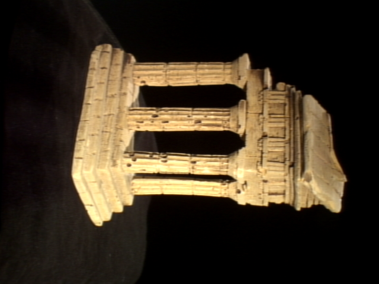
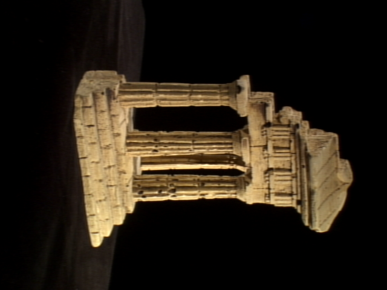
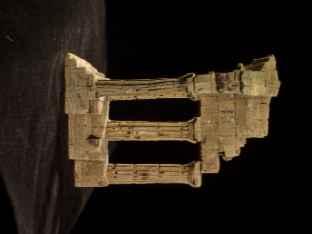
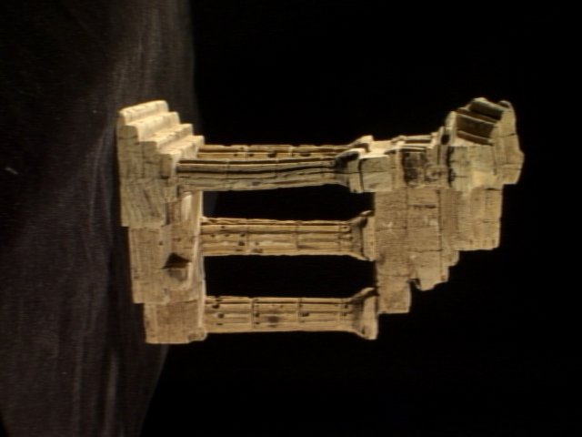

## Real Results 
The reconstruction results will be saved in the `results` folder. Here are some sample visualizations:


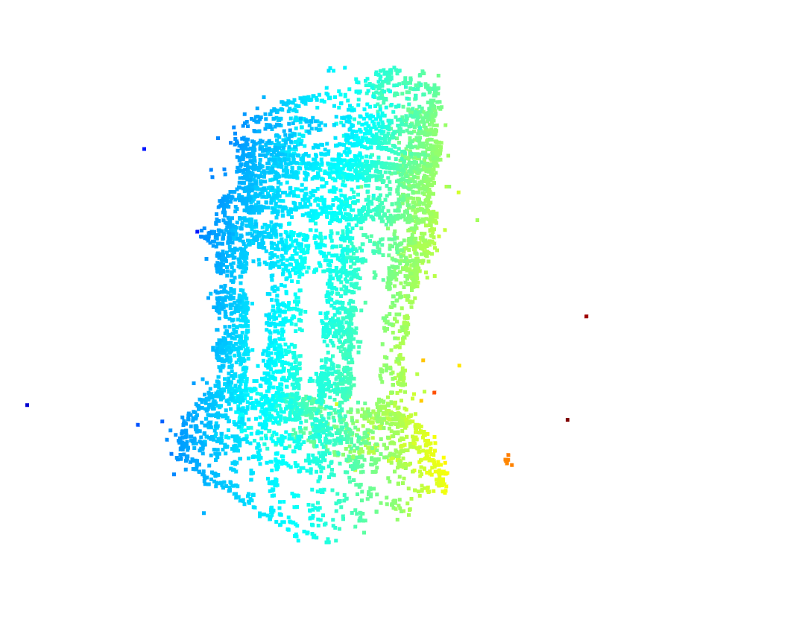
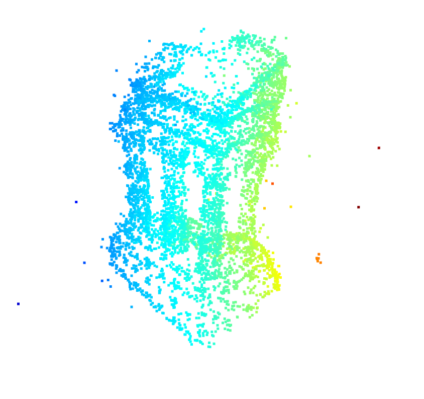
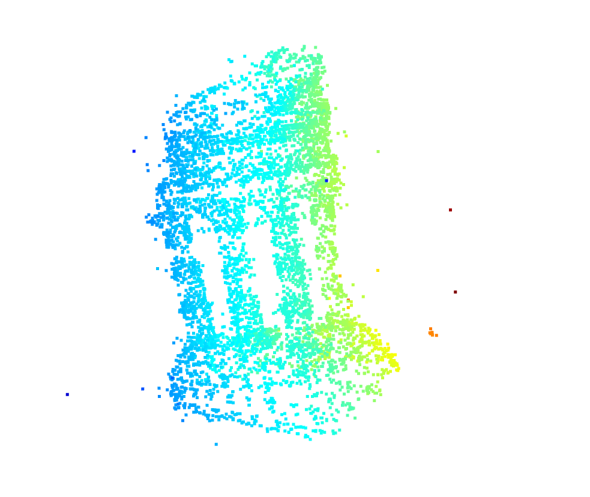
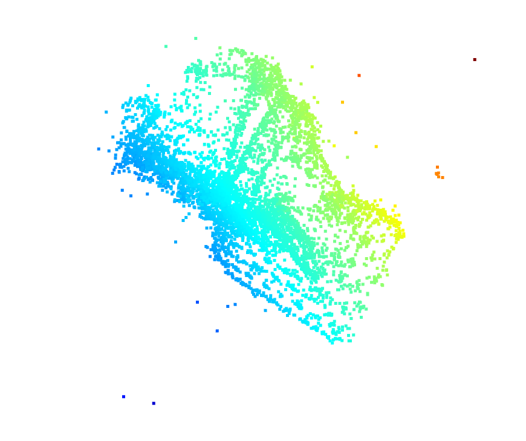


## Implementation Details

### Key Classes and Functions
* **Feature Extraction and Matching**
   * `extract_sift_features()`: Detects SIFT keypoints and computes descriptors.
   * `match_sift_descriptors()`: Performs kNN matching with ratio test.
   * `filter_correspondences()`: Removes outliers using RANSAC and the fundamental matrix.
* **Reconstruction**
   * `select_initial_image_pair()`: Chooses the best pair to start reconstruction.
   * `initialize_reconstruction()`: Sets up the initial two cameras and 3D points.
   * `select_next_image_pair()`: Determines which image to add next.
   * `fetch_pnp_correspondences()`: Prepares 3D-2D correspondences for PnP.
   * `estimate_pose_pnp()`: Computes the pose of a new camera.
   * `triangulate_and_reproject()`: Creates new 3D points from image pairs.
* **Bundle Adjustment**
   * `bundle_adjust()`: Performs sparse bundle adjustment optimization.
   * `ba_residuals()`: Computes reprojection errors for bundle adjustment.
   * `build_ba_sparsity()`: Constructs the Jacobian sparsity pattern.
* **Data Structures**
   * `Point3DWithViews`: Associates a 3D point with its 2D observations.

### Algorithmic Decisions
1. **Initial Pair Selection**: We choose image pairs with many matches and significant rotation to ensure good triangulation.
2. **Incremental Image Addition**: Images are added in a pattern that follows the ring-like sequence of the datasets.
3. **RANSAC Parameters**: We use a 5.0 pixel threshold for PnP RANSAC to handle noisy keypoints.
4. **Bundle Adjustment Scheduling**: We run bundle adjustment at increasing intervals as the reconstruction grows to balance performance and accuracy.
5. **Point Filtering**: We filter out triangulated points that are too far from the scene to remove outliers.


##  Discussion

This project successfully implemented an **incremental Structure from Motion (SfM)** pipeline using classical computer vision techniques. The reconstruction was built from a pre-calibrated image dataset and followed a structured pipeline: from feature extraction and matching to triangulation and global bundle adjustment.

---

###  3D Reconstruction Quality

The resulting 3D point cloud (see above) demonstrates good spatial coherence and structural geometry, particularly in regions with strong texture and overlapping viewpoints. The colored depth distribution indicates that features were successfully matched and triangulated across a wide range of perspectives.

Although some noise and sparse outliers exist, the dense shape consistency confirms that the incremental reconstruction worked correctly.

---

###  Reprojection Error Analysis

To evaluate the geometric accuracy of the reconstruction, we monitored the **mean reprojection error** as new views were added. As shown in the plot below:


- The mean error generally remained **below 0.3 pixels**, with local fluctuations depending on image overlap and feature distribution.
- A slight increase in error occurred mid-sequence, possibly due to views with limited visual overlap or fewer distinctive keypoints.
- The error remained stable after Bundle Adjustment, validating the optimization process.

⮕ These values indicate a **robust calibration and consistent triangulation**, as errors below 1 pixel are typically acceptable in SfM.


---

# Challenges 

Throughout the project, we faced several technical and practical challenges that influenced the workflow, especially when working with a **custom dataset** and comparing it with **pre-calibrated academic datasets** like TempleRing or DinoRing.

---


### 1. Object Selection and Visual Texture

Finding a suitable object for 3D reconstruction was a major obstacle. Many real-world objects lacked:
- Enough texture or features,
- Clear color contrast,
- Consistent lighting response.

> We attempted reconstruction with three different objects, but none produced usable results due to poor keypoint extraction and matching.

| 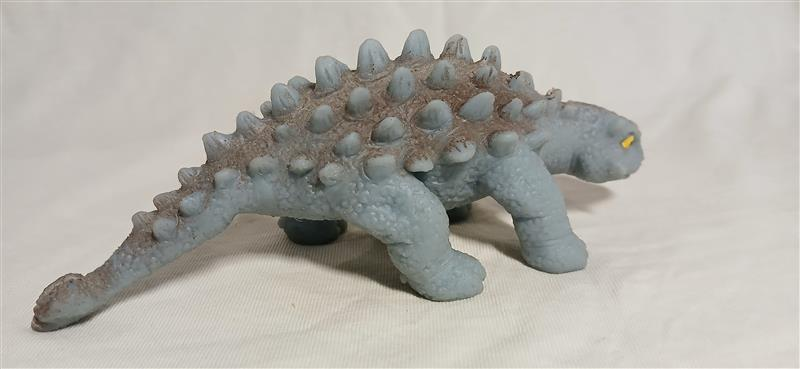 |  |
|:------------------------------:|:------------------------------:|
*Object attempt 1*             

| 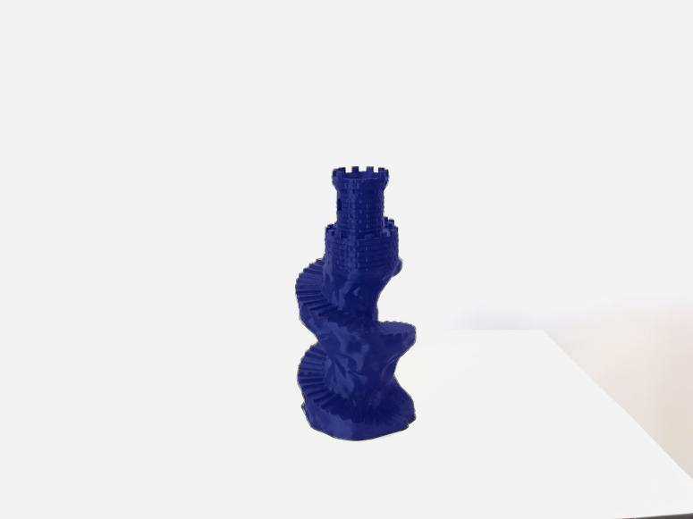 | 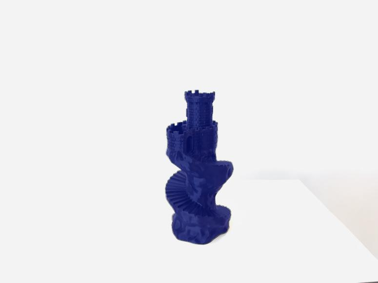 |
|:---------------------------------:|:---------------------------------:|
 *Object attempt 2*            

### 2. Image Resolution and Storage Issues

High-resolution images significantly increased:
- Processing time,
- Memory usage,
- Storage requirements (over 1 GB for 1 dataset).

To mitigate this, we had to **reduce image quality** and resolution — a trade-off between accuracy and computational feasibility.


### 5. Long Computation Time and Crashes

For some datasets, especially with 40+ images, the pipeline required over **600 minutes** on a standard laptop, eventually causing a system crash.

> Interestingly, the same pipeline worked perfectly with pre-calibrated datasets — highlighting the difficulty of handling real-world uncontrolled conditions.

### 5.Calibration Sensitivity: 
Small errors in checkerboard detection or lighting conditions caused instability in the estimation of intrinsic parameters. We had to enhance the calibration script multiple times, experimenting with different board sizes, image counts, and angle coverage.

### 6. Feature Matching Issues: 
Despite using SIFT, matching consistency was a challenge across certain image pairs — particularly in cases with repetitive textures or low contrast. We faced:
  - False matches (outliers) despite using Lowe's ratio test,
  - Difficulty achieving sufficient good matches for later triangulation steps.


### 7. PnP Correspondence Limitation

In the incremental phase, Perspective-n-Point (PnP) estimation required enough 2D–3D matches. If insufficient matches existed between the new view and existing points, pose estimation failed or became inaccurate.

### 8. Bundle Adjustment Scalability

While bundle adjustment significantly refined the model, it was:
- Computationally expensive,
- Memory intensive when working with dozens of views and thousands of points.

Using full BA without sparsity exploitation could slow down the process drastically.

---

### Limitations
* Dense reconstruction is not implemented; the result is a sparse point cloud.
* No texture mapping is applied to the reconstructed points.
* Performance could be improved with GPU acceleration for feature extraction and matching.
* The system assumes calibrated cameras with known intrinsics.


---

## Future Work

While this project demonstrates a complete Structure from Motion (SfM) pipeline, several improvements can be made to enhance performance, scalability, and robustness:

- **Loop Closure & Global Optimization**: Add loop closure detection to mitigate drift and enable global bundle adjustment for large scenes.
- **Dense Reconstruction**: Extend the pipeline beyond sparse point clouds to generate dense 3D reconstructions or meshes.
- **Feature Robustness**: Replace SIFT with deep-learning-based keypoint extractors (e.g. SuperPoint + SuperGlue) for better matching in low-texture scenes.
- **GPU Acceleration**: Utilize OpenCL/CUDA or libraries like COLMAP to significantly reduce processing time.
- **Automatic Calibration**: Automate the checkerboard calibration and integrate dynamic intrinsics estimation for real-world applications.

---

##  Acknowledgments

This implementation is based on multiple computer vision and structure from motion techniques. The datasets (Temple Ring and Dino Ring) are from the Middlebury Multi-View Stereo dataset.

We would like to thank our supervisors:
- **Prof. Dr. David Fofi**,  
- **Dr. Yohan Fougerolle**,  
- **Dr. Zaar Khizar**

for their guidance, constructive feedback, and support throughout the project.

---

# Conclusion

This project has successfully implemented an end-to-end Structure from Motion system, capable of recovering 3D geometry and camera motion from a set of unordered images. By combining feature extraction, RANSAC-based matching, triangulation, PnP, and bundle adjustment, we demonstrated that accurate and scalable 3D reconstruction is achievable using classical computer vision techniques.

Despite challenges with real-world datasets, the system performed reliably on calibrated image sequences, validating both our theoretical understanding and implementation skills.

> This work reinforces key competencies in camera modeling, image processing, numerical optimization, and practical computer vision — laying a solid foundation for more advanced 3D vision applications in the future.

---

## References

1. Zhengyou Zhang. *A flexible new technique for camera calibration*. IEEE Transactions on Pattern Analysis and Machine Intelligence, 22(11):1330–1334, 2000.

2. Richard Hartley and Andrew Zisserman. *Multiple View Geometry in Computer Vision*. Cambridge University Press, 2004.

3. Noah Snavely, Steven M. Seitz, Richard Szeliski. *Bundler: Structure from Motion for Unordered Image Collections*. ACM SIGGRAPH, 2006.

---
